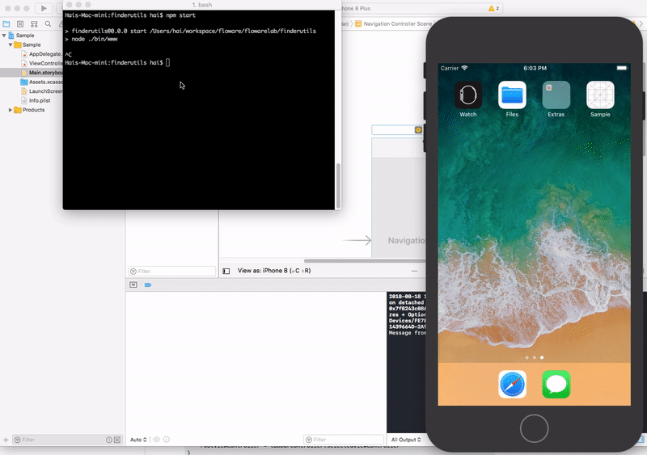
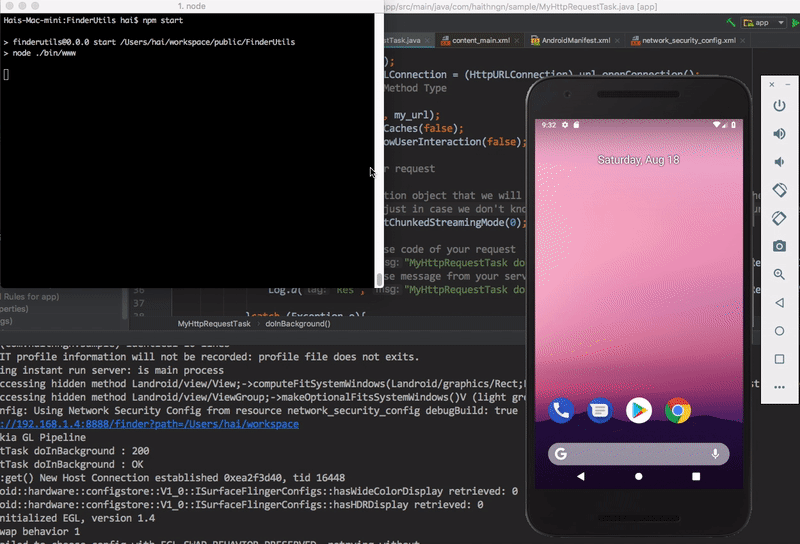

# FinderUtils
Reveal Mac OS Application running directory from a HTTP Request.

Java

### Why?
Whenever start debugging iOS application on Simulator OSX copy/make a random directory for that app sometime you have to log the application directory then reveal it via OSX Finder Application.
FinderUtils do it by start a small resfult service and handle the request from wherever then open the directory in Finder.
## Requirement
+ Node JS
+ Mac OS

## Installation
1. Install Node
> npm install npm
2. Checkout this repository
> git clone git@github.com:haithngn/FinderUtils.git
3. Install Node Modules
Navigate to the source code directory.
> npm install

## Usage
1. Start the Finder Utils Server
> npm start
2. Make an HTTP Request

Swift
~~~~swift 
//Define which directory you want to reveal.
let documentsPath = NSSearchPathForDirectoriesInDomains(.documentDirectory, .userDomainMask, true)[0]
let url = URL(string: "http://127.0.0.1:8888/finder?path=\(documentsPath)")
var request = URLRequest(url: url!)
        request.httpMethod = "GET"
NSURLConnection.sendAsynchronousRequest(request, queue: OperationQueue.main) {(response, data, error) in
            print("res + \(NSString(data: data!, encoding: String.Encoding.utf8.rawValue))")
}
~~~~
Objective-C
~~~~obj-c
NSMutableURLRequest *request = [[NSMutableURLRequest alloc] 
        initWithURL:[NSURL 
        URLWithString:@"http://127.0.0.1:8888/finder?path=%@", documentsPath]];
 
[request setHTTPMethod:@"GET"];
~~~~

Java
~~~~java
URL url = new URL("192.168.1.111:8888/finder?path=Your_ADV_Folder");
            HttpURLConnection httpURLConnection = (HttpURLConnection) url.openConnection();
~~~~

## Contribution
+ Feedback and issues are welcome.
+ Feel free to make PR(s).

## License
[MIT licensed.](https://github.com/realm/SwiftLint/blob/master/LICENSE)

### About
@[haithngn](https://haithngn.com)

Like Finder Utils? Please give me a star then tell your friends! 🍻